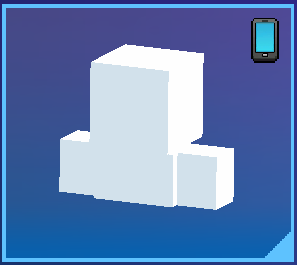
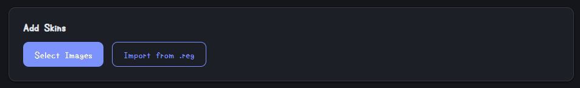
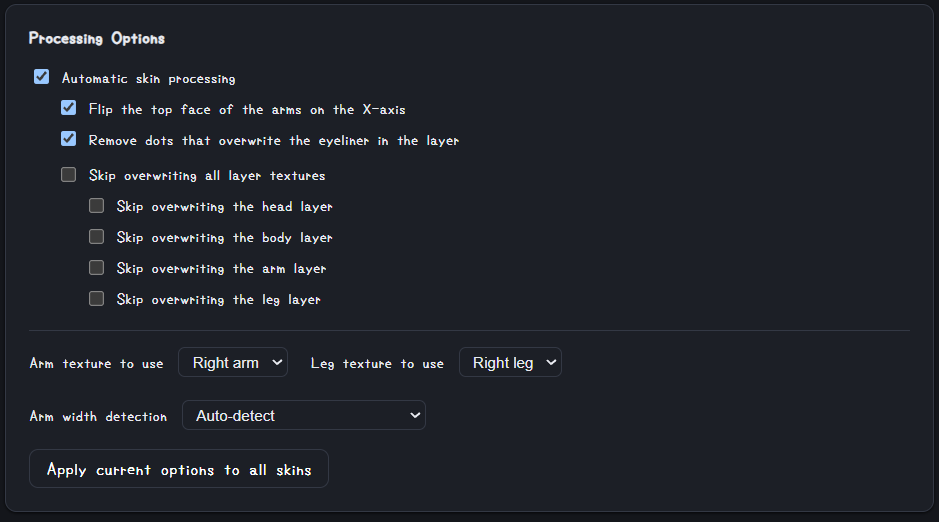
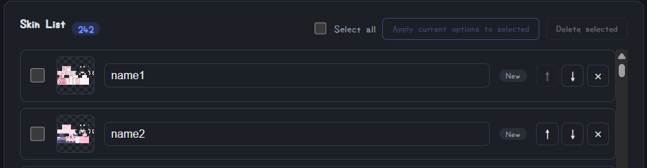
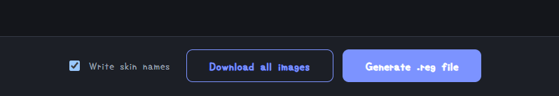

# PG3D Custom Skin Importer

[English](README.md) | [日本語](README.ja.md)

A static HTML tool for editing your Pixel Gun 3D local skins in various ways.

> [!WARNING]
> If you already have local skins in-game, make sure to use **"Import from .reg"** first. Otherwise, your existing local skins will be overwritten.
> Local skins show a small smartphone icon next to their name, as shown in the image below.
>
>
>
> See [here](#extracting-a-reg-file-with-regedit) for how to obtain a `.reg` file.

Repository: https://github.com/mof-22/PG3D_skin_importer

To use the hosted page, please visit https://mof-22.github.io/PG3D_skin_importer/

## Overview

Through `.reg` files, this tool lets you make edits such as:

- Bulk-importing skins
- Exporting in-game skins (as a batch of image files)
- Renaming and reordering skins

There's a lot more it can do — see [Usage](#usage) below for details.

### Benefits

- **No installation** — runs entirely as a static web page. Open `index.html` directly, or use the [hosted version](https://mof-22.github.io/PG3D_skin_importer/) without downloading anything at all.
- **Automatic fixes** — merges the second skin layer onto the base layer, removes dots that overwrite the eyeliner, and detects/converts arms that are still 3px wide to the 4px width the game expects, minimizing the visual damage carried over from Minecraft-format skins.
- **Per-skin options** — every skin keeps its own settings, so a batch mixing already-fixed and never-fixed skins can each be tuned individually. Options can also be applied in bulk to all skins, or just to a selection.
- **3D preview** — instantly check how option changes will look, matching how the skin actually renders in-game.
- **Everything stays local** — all image processing and file reading/writing happens inside your browser. Nothing is ever uploaded anywhere.

### Requirements

- **Windows** — the tool itself (image processing, reading and generating `.reg` files) works on any OS, but actually applying the generated `.reg` to the registry is Windows-only — so in practice this tool is only useful on Windows.
- **A modern, WebGL-capable browser** (Chrome, Edge, Firefox, etc.) — required for the tool to run and for the 3D preview to work.

### Disclaimer

This is an unofficial, fan-made tool and is not affiliated with, endorsed by, or supported by the developers of Pixel Gun 3D. It is provided "as is", without warranty of any kind, express or implied. The author accepts no responsibility and offers no support for any bugs, data loss, account suspension or bans, or any other damage or issue arising from the use of this tool. **Use it at your own risk.**

The underlying technique was discovered independently by the author, but the tool itself was built using Claude Code, so bugs or rough edges may remain. Thank you for your understanding.

## Usage

### Quick start

1. Open the tool in your browser.
2. Add skin images, and/or import an existing `.reg` file.
3. Adjust the processing options as needed and check the 3D preview.
4. Generate a `.reg` file (or download the images) and apply it in-game.

### Adding skins

- **Select Images** — pick one or more image files. Each one is processed immediately using the current options and added to the list. Files that are byte-for-byte identical to one already in the list are skipped automatically.
- **Import from .reg** — reads skins from a `.reg` file. **If you already have local skins in-game, always start here** (see the warning at the top of this page). See [here](#extracting-a-reg-file-with-regedit) for how to obtain a `.reg` file.

### Processing options

- **Automatic skin processing** — the master switch for every fix below. Turn it off to leave the image completely untouched.
- **Flip the top face of the arms on the X-axis** — compensates for how Pixel Gun 3D renders the arm's top face. Leave this on unless you have a specific reason not to.
- **Remove dots that overwrite the eyeliner in the layer** — clears a few pixels in the layer that would otherwise cover the base skin's eyeliner. Generally useful for humanoid-style skins, but may cause issues on more symbolic or geometric designs.
- **Skip overwriting layer textures** — the head/body/arm/leg "second layer" (e.g. clothing) is normally merged onto the base skin. These checkboxes let you skip that merge entirely, or just for specific body parts.
- **Arm/leg texture to use (right/left)** — classic-format skins only store one arm's and one leg's worth of data; the other side is generated as a mirrored copy. Use this to choose which side's data to use as the source (handy when a skin only has data on one side, or if you simply prefer the other side's design).
- **Arm width detection** — corrects the arm portion of a skin. It's automatically converted to the 4px width the game expects, but you can also override this manually if the automatic detection isn't perfect.
- **Apply current options to all skins** — overwrites every skin's individual settings with whatever is currently shown in the panel, and reprocesses all of them.

### Skin list

- **Checkbox** — for multi-selecting skins (used by "Select all", "Apply current options to selected", and "Delete selected" above the list).
- **Thumbnail** — shows the skin's unwrapped texture layout.
- **Name** — editable. Defaults to the file name, or (for skins imported from `.reg`) the in-game name.
- **New/Imported badge** — shows whether the skin came from an image file or from a `.reg`.
- **↑ / ↓** — move the skin one position at a time. **Shift-click** either button to jump straight to the top or bottom of the list instead.
- **×** — deletes that skin.

**About pinning:** because hovering updates the preview, your cursor passing over the list on its way to the preview can accidentally switch which skin is shown. Click anywhere on a row (other than its name field, buttons, or checkbox) to *pin* the preview to that skin — while pinned, hovering other rows won't change the preview. Click the row again, or click the "📌 Pinned" text below the preview, to unpin.

### 3D preview

- **Drag** — rotates the model.
- **Scroll** — zooms in and out.
- The background matches your current theme.

### Output

- **Write skin names** — when checked, each skin's name is written into the `.reg` file and shown in-game. When unchecked, the name value is still written, but left blank — useful when file names are just random hashes.
- **Generate .reg file** — reprocesses each skin with its own options, then downloads a `.reg` file ready to apply to the registry.
- **Download all images** — downloads every loaded skin as a single ZIP of PNG files. Handy when you want the skins you built in-game back as image files.

### Extracting a `.reg` File with regedit

1. Press `Win` + `R` and type `regedit`.
2. In the path bar at the top, enter `HKEY_CURRENT_USER\Software\Pixel Gun Team\Pixel Gun 3D`.
3. From the menu at the top, choose **File → Export...**
4. Save it wherever you like, under any name.

*This tool never reads any key or value other than `User Skins_h1196497400` and `User Name Skins_h1318731231`, but if you'd feel more comfortable, feel free to remove any other data from the file manually before importing it.*

<!-- TODO: link to a GIF of the steps above -->

### Settings

- **Theme** — choose Light, Dark, or System (follows your OS setting).
- **Language** — switch between Japanese and English at any time.

## FAQ

**If I generate a new `.reg`, does it merge with the skins already in-game, or replace them?**
It replaces them, since the registry value holds all of your skins as a single block. If you want to keep skins you already have installed, first import your current `.reg` into the tool, then add or edit skins, and generate again from that full list. See [here](#extracting-a-reg-file-with-regedit) for how to obtain a `.reg` file.

**Is it safe to use? Could my account get banned?**
This tool only edits a limited set of data in your local registry, and never communicates with any server. That said, we can't guarantee it behaves exactly the same as skins created normally in-game, so we can't promise nothing will ever go wrong. Please keep this in mind.

**There are black patches on the back of the arm or on the hand after processing.**
Check that skin's "Arm width detection" option. Skins with an author's signature or an opaque background near the detection point can occasionally be misjudged as "already 4px wide". When that happens, the part that should have been converted stays transparent instead — and since transparent pixels render as black in-game, that shows up as a black patch on the arm. If this happens, switch the setting to "Force convert" manually.

## License

This project is licensed under the [MIT License](LICENSE).
